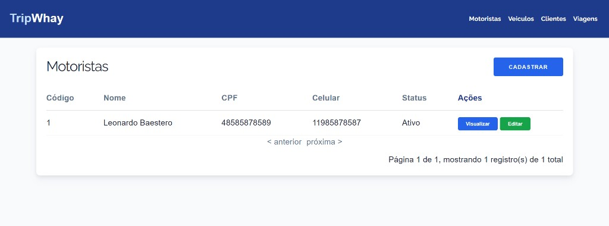

# TripWay



**Demo em produção:** [https://tripway-eykv.onrender.com/](https://tripway-eykv.onrender.com/) — backend e banco PostgreSQL hospedados no [Render](https://render.com).

---

## Sobre o projeto

O **foco principal** deste projeto é a **modelagem do banco de dados** e os **relacionamentos** entre entidades de um cenário de logística real (motorista, veículo, cliente e viagem), materializados em um **MVP funcional**.

O dashboard em **CakePHP 4** existe para validar esse modelo na prática: CRUD das entidades, integridade referencial (FKs, índices únicos) e regras de negócio que dependem dos vínculos (por exemplo, veículo pertencente a um motorista e viagem ativa ocupando motorista/veículo). As validações de domínio mais sensíveis ficam em `src/Service/TripService.php`.

A página inicial redireciona para a listagem de motoristas (`/` → `/drivers`).

---

## Funcionalidades

| Módulo      | Rotas (convenção CakePHP) | Descrição |
|------------|---------------------------|-----------|
| Motoristas | `/drivers`                | CRUD com nome, CPF, telefone e status (`active` / `inactive`) |
| Veículos   | `/vehicles`               | CRUD vinculado a um motorista; validação de placa (padrão Mercosul) |
| Clientes   | `/clients`                | CRUD com endereço completo e documento único |
| Viagens    | `/trips`                  | Criação com validações de negócio; edição só do itinerário (viagens ativas); encerramento |

Cada entidade possui as ações padrão geradas pelo Bake: **index**, **add**, **edit**, **view** e **delete** (com paginação nas listagens).

---

## Modelo de dados

Esta seção é o núcleo do MVP: o desenho relacional espelha operações típicas de uma operação logística — quem dirige, qual frota está alocada, para qual cliente e qual rota está em andamento.

Relacionamentos entre as tabelas:

```
Driver (1) ──< Vehicles
Driver (1) ──< Trips
Vehicle (1) ──< Trips  (belongsTo Driver)
Client (1) ──< Trips
Trip ── belongsTo Driver, Vehicle, Client
```

### Principais campos

- **drivers**: `name`, `cpf` (único), `phone`, `status`
- **vehicles**: `driver_id`, `license_plate` (único), `model`, `brand`, `year`, `status`
- **clients**: `name`, `phone`, `document` (único), endereço (`zip_code`, `street`, `number`, `city`, `state`), `status`
- **trips**: `driver_id`, `vehicle_id`, `client_id`, origem/destino (`origin_city`, `origin_state`, `destination_city`, `destination_state`), `start_at`, `finished_at`, `status`

As migrations ficam em `config/Migrations/` e podem ser aplicadas com:

```bash
bin/cake migrations migrate
```

---

## Regras de negócio

### Camada Service — `src/Service/TripService.php`

A criação e o encerramento de viagens passam pelo service, chamado pelo `TripsController`.

**Ao criar uma viagem (`createTrip`):**

1. Motorista deve existir e estar com status **active**
2. Motorista não pode ter outra viagem com status **active**
3. Veículo deve existir e estar **active**
4. Veículo não pode estar em outra viagem **active**
5. O `driver_id` da viagem deve ser o mesmo `driver_id` vinculado ao veículo
6. Cliente deve existir e estar **active**

Falhas lançam `RuntimeException` com mensagem em português; o controller exibe via Flash.

**Ao encerrar uma viagem (`finishTrip`):**

- Só viagens com status **active** podem ser finalizadas
- Atualiza `status` para **inactive** e preenche `finished_at`

### Controller — `TripsController`

- **add**: delega para `TripService::createTrip()`
- **finishTrip**: delega para `TripService::finishTrip()` (ação na listagem de viagens)

**Edição de viagem (`edit`):**

- **Não é possível editar** uma viagem com status **inactive** (encerrada). O controller redireciona com mensagem de erro antes de abrir o formulário.
- Em viagens **active** (em andamento), a edição permite alterar **somente o itinerário**: cidade e estado de origem e de destino (`origin_city`, `origin_state`, `destination_city`, `destination_state`).
- Motorista, veículo, cliente, datas e status **não** entram no formulário de edição (`templates/Trips/edit.php`) — esses vínculos são definidos na criação e nas regras do `TripService`.

### Validações nas Models (Tables)

Regras de formulário e integridade ficam nas classes `*Table` (geradas/ajustadas pelo Bake), por exemplo:

- CPF do motorista: 11 dígitos numéricos, único
- Placa do veículo: regex Mercosul (`ABC1D23`)
- Chaves estrangeiras validadas em `buildRules()`

---

## Stack técnica

- **PHP** >= 7.4 (Docker usa 8.1)
- **CakePHP** ^4.5
- **Banco**: PostgreSQL em produção/Docker; SQLite nos testes de CI
- **Migrations**: `cakephp/migrations`
- **Frontend**: templates CakePHP + CSS (Milligram, layout em `templates/layout/default.php`)

---

## Estrutura do projeto

```
src/
├── Controller/     # CRUD (Drivers, Vehicles, Clients, Trips)
├── Model/
│   ├── Entity/
│   └── Table/      # Validações e associações ORM
└── Service/        # Regras de negócio (TripService)

templates/          # Views por recurso (index, add, edit, view)
config/
├── Migrations/     # Schema do banco
├── routes.php      # Rota raiz → Drivers::index
└── app_local.php   # Config local (não versionar credenciais)

docker/             # Apache + entrypoint (gera app_local e roda migrations)
```

Documentação interna de desenvolvimento: `Anotações_Dev.md`.

---

## Desenvolvimento local

### Pré-requisitos

- PHP 7.4+ com extensões `intl`, `mbstring` e driver do banco (PostgreSQL ou SQLite)
- [Composer](https://getcomposer.org/)
- PostgreSQL (recomendado) ou outro banco suportado pelo CakePHP

### Instalação

```bash
composer install
cp config/app_local.example.php config/app_local.php
```

Configure o datasource em `config/app_local.php` (host, usuário, senha, database). Exemplo para PostgreSQL:

```php
'Datasources' => [
    'default' => [
        'className' => 'Cake\Database\Connection',
        'driver' => 'Cake\Database\Driver\Postgres',
        'host' => 'localhost',
        'username' => 'seu_usuario',
        'password' => 'sua_senha',
        'database' => 'tripway',
        'port' => 5432,
    ],
],
```

Gere um salt de segurança e ajuste `Security.salt` conforme a documentação do CakePHP.

```bash
bin/cake migrations migrate
bin/cake server -p 8765
```

Acesse: `http://localhost:8765`

### Testes e qualidade

```bash
composer test          # PHPUnit
composer cs-check      # PHP CodeSniffer
```

---

## Docker e deploy

O `Dockerfile` monta uma imagem **PHP 8.1 + Apache** com extensões **pdo_pgsql** e executa o `docker/entrypoint.sh`, que:

1. Gera `config/app_local.php` a partir das variáveis de ambiente
2. Executa `bin/cake migrations migrate`
3. Sobe o Apache na porta 80

### Variáveis de ambiente (produção)

| Variável        | Descrição        |
|----------------|------------------|
| `DB_HOST`      | Host PostgreSQL  |
| `DB_USER`      | Usuário          |
| `DB_PASSWORD`  | Senha            |
| `DB_DATABASE`  | Nome do banco    |
| `DB_PORT`      | Porta (padrão 5432) |
| `SECURITY_SALT`| Salt do CakePHP  |

Build e execução local:

```bash
docker build -t tripway .
docker run -p 8080:80 \
  -e DB_HOST=... -e DB_USER=... -e DB_PASSWORD=... \
  -e DB_DATABASE=... -e SECURITY_SALT=... \
  tripway
```

A aplicação em produção roda no **Render** (web service + PostgreSQL): [https://tripway-eykv.onrender.com/](https://tripway-eykv.onrender.com/). Detalhes do deploy e lições aprendidas estão em `Anotações_Dev.md`.

---

## Rotas principais

Além da rota explícita `/` → motoristas, o CakePHP usa **fallbacks** (DashedRoute):

| URL                    | Ação              |
|------------------------|-------------------|
| `/drivers`             | Listar motoristas |
| `/drivers/add`         | Novo motorista    |
| `/vehicles`, `/clients`, `/trips` | Mesmo padrão CRUD |
| `/trips/finish-trip/:id` | Encerrar viagem |

---

## Comandos úteis (Bake)

Gerados durante o desenvolvimento do projeto:

```bash
bin/cake bake migration NomeDaMigration
bin/cake migrations migrate
bin/cake bake all Drivers   # ou Clients, Vehicles, Trips
```

---

## Licença

MIT (base CakePHP App skeleton).
